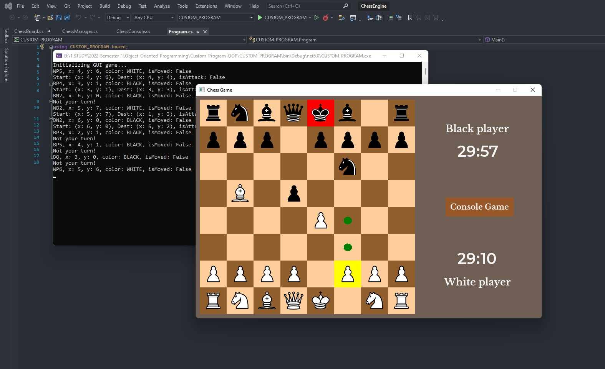
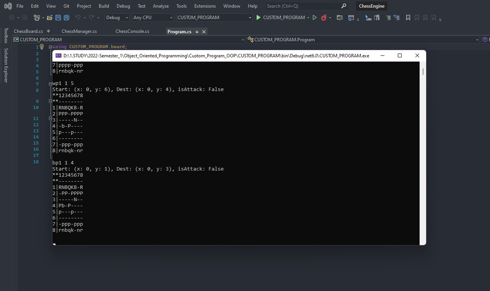

# Chess Game
My HD Custom Program used to practice Object-Oriented Programming principles

## Features
* Player-vs-Player
* Undo and Redo moves
* Highlight the square that the mouse hovers on
* Possible moves highlighting
* Warning when king is under possible attack
* User can switch between console and GUI to display the game at runtime
* Countdown timers
* Pawn promotion

## Interface

## Design
### Design Patterns
1.	Factory:
I use Factory Pattern for ChessBoard to generate pieces without having to specify the exact class of the pieces that will be created
2.	Singleton:
I use this pattern for PieceFactory, as I need to make sure that only one single object of this class gets created
3.	Command:
To enable the user to Undo and Redo while play the game, I will use Command pattern to makes actions such as Move a piece and Attack a piece into Commands. That way, I can store those commands and go back and forth if the player wants to undo or redo.
4.	Strategy:
I use Strategy pattern to allow the user to switch the method to display the game at runtime (i.e., GUI and console). This will help my program more complex and flexible
### Design Principles
1.	Extensible:
My program can be updated to have many more chess-like games, such as checker, go with minimal modifications
2.	Robust:
I have coded my program so that it can be bullet-proofed to (almost) any syntax errors
3.	Flexible & Modular:
My game can easily switch between console and GUI based on the user on runtime. It can also be displayed with any other libraries
